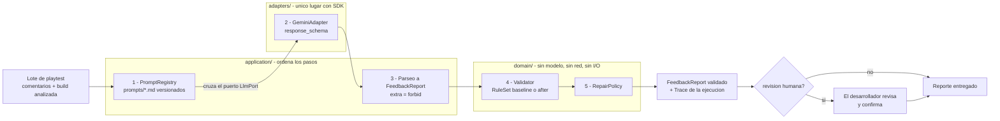

# QuickDev

QuickDev analiza el feedback de un **playtest cerrado de un videojuego indie** —antes del
lanzamiento, cuando todavía no hay reseñas de Steam y el feedback vive en Discord privado,
formularios y builds de itch.io— y entrega un reporte JSON agregado: resumen, sentimiento,
problemas priorizados con su frecuencia, citas de evidencia, comentarios descartados con su motivo
y un flag de revisión humana.

> **El modelo interpreta lenguaje. El código verifica hechos.**

---

## 1. Qué decide el sistema y qué decide una persona

| Lo hace el modelo (interpreta) | Lo hace el código (verifica) | Lo decide una persona |
| --- | --- | --- |
| Clasificar comentarios por categoría | Que `total_comentarios_analizados` sea `len()` del lote | Si los problemas detectados son reales |
| Agrupar los que hablan de lo mismo | Que ninguna `frecuencia` supere el total | Si un descarte estuvo bien hecho |
| Resumir y detectar el sentimiento | Que cada cita exista literalmente en el lote | **Qué se corrige en la siguiente build** |
| Priorizar (alta / media / baja) | Que `version_juego` sea la build analizada | |
| Separar ruido, sesgo y extremismo | Enums, rangos y campos (esquema + proveedor) | |
| | **Forzar `requiere_revision_humana` ante cualquier hallazgo** | |

Una instrucción en el prompt no es una garantía; una validación posterior sí. Por eso las dos
cosas existen, y solo la segunda es verificable. Y por eso nada desaparece en silencio: todo
comentario que el modelo no usa queda en `comentarios_descartados` con su motivo, para que el
desarrollador pueda auditar qué se ignoró.

---

## 2. Arranque en 3 comandos (sin API key)

```bash
git clone https://github.com/david181222/QuickDev.git && cd QuickDev && python -m venv .venv
.venv/bin/python -m pip install -e ".[dev]"     # Windows: .venv/Scripts/python.exe
.venv/bin/quickdev demo                         # Windows: .venv/Scripts/quickdev.exe demo
```

`quickdev demo` analiza el lote normal de 14 comentarios **sin red y sin API key**: la respuesta
del modelo es la que se grabó al medir el prompt `after`, y todo lo que ocurre después —parseo,
validación, reparación y traza— es el código de verdad.

Todo lo demás también corre sin clave:

```bash
.venv/bin/python -m pytest                  # 436 tests, sin red (los que llaman a la API: -m llm)
.venv/bin/python -m ruff check .
.venv/bin/python scripts/gate_baseline.py   # 7/7: el refactor no cambió lo medido
.venv/bin/quickdev eval --prompt baseline --solo-regresiones
.venv/bin/quickdev eval --prompt baseline --replay evals/resultados/baseline/crudo.json  # escribe una corrida nueva en evals/resultados/
.venv/bin/quickdev analyze --batch docs/ejemplos/lote_normal.json --replay evals/resultados/after/crudo.json
```

Solo hace falta la clave para llamar al modelo de verdad:

```bash
cp .env.example .env                        # y pega tu GEMINI_API_KEY
.venv/bin/quickdev analyze --batch mi_lote.json
.venv/bin/quickdev eval --prompt after --n 10
```

Un lote es un JSON como [`docs/ejemplos/lote_normal.json`](docs/ejemplos/lote_normal.json):
`{"build": "v0.8.2" | null, "comentarios": [{"fuente": "discord|steam|encuesta|red_social", "texto": "..."}]}`.

Si vas a tocar el notebook, activa una vez por clon el filtro que le quita los outputs antes de
cada commit: `.venv/bin/nbstripout --install`.

---

## 3. La frontera modelo / código



El modelo entra **una sola vez y por un puerto** (`LlmPort`). La validación ocurre después y sin
él: `quickdev/domain/` no importa nada de infraestructura. El detalle de capas está en
[`docs/arquitectura.md`](docs/arquitectura.md).

### Las reglas de validación

Nueve reglas, una clase por regla. Una versión del validador es una **composición** distinta de
ellas, no un `if` dentro de una función ([ADR-0003](docs/adr/0003-una-regla-una-clase.md)).

| Regla | Qué comprueba | Corrección si falla | baseline | after |
| --- | --- | --- | :-: | :-: |
| [`TotalMatchesBatch`](quickdev/domain/rules/counts.py) | total = comentarios del lote | total = `len(lote)` | ✓ | ✓ |
| [`FrequencyWithinTotal`](quickdev/domain/rules/counts.py) | ninguna frecuencia supera el total | ninguna: se escala | ✓ | ✓ |
| [`QuotesAreLiteral`](quickdev/domain/rules/citations.py) | cada cita existe literal en el lote | ninguna: se escala | ✓ | ✓ |
| [`VersionAppearsLiterally`](quickdev/domain/rules/versioning.py) | la versión aparece en el input | versión = null | ✓ | ✓ |
| [`VersionIsNotNull`](quickdev/domain/rules/versioning.py) | la versión no es null *(falso positivo conservado)* | solo revisión = true | ✓ | |
| [`VersionIsAnalyzedBuild`](quickdev/domain/rules/versioning.py) | la versión es la build analizada | versión = build | | ✓ |
| [`DiscardedBiasRequiresReview`](quickdev/domain/rules/review.py) | un descarte sesgado/extremista pide revisión | revisión = true | ✓ | ✓ |
| [`MultipleBuildsRequireReview`](quickdev/domain/rules/review.py) | más de una build en el lote pide revisión | revisión = true | | ✓ |
| [`AnyDiscardRequiresReview`](quickdev/domain/rules/review.py) | cualquier descarte pide revisión | revisión = true | | ✓ |

La composición exacta está en [`registry.py`](quickdev/domain/rules/registry.py). Detectar y
reparar son dos clases separadas, `Validator` y `RepairPolicy`
([ADR-0004](docs/adr/0004-detectar-vs-reparar.md)): la frecuencia y las citas no se "arreglan"
porque no se puede adivinar el dato real, y fabricarlo es justo lo que el producto promete no hacer.

---

## 4. Dos recetas

### Agregar una regla

1. Crea la clase en el archivo temático de [`quickdev/domain/rules/`](quickdev/domain/rules/), con un `id` y un `check(report, batch)` que devuelva `Finding`s.
2. Añádela a una versión **nueva** en [`registry.py`](quickdev/domain/rules/registry.py) (`baseline` y `after` son registro histórico: no se editan).
3. Si tiene corrección, añade su fila a la tabla de `RepairPolicy` en [`validation.py`](quickdev/domain/validation.py).
4. En [`tests/domain/test_rules.py`](tests/domain/test_rules.py), dos casos: uno que la dispare y **otro que confirme que no da falso positivo**.
5. `pytest` y `scripts/gate_baseline.py` (7/7). Si el gate cambia, la regla cambió lo medido: documéntalo en un ADR.

### Agregar un eval

1. En [`evals/cases.py`](evals/cases.py), define el lote con `lote([(fuente, texto), ...], build)`.
2. Añade un `EvalCase(id, categoria, batch, hipotesis, asserts)` a `EVALS`, reutilizando las aserciones `a_*` del mismo archivo.
3. Escribe la **hipótesis antes de correrlo**: qué esperas que haga el modelo y por qué.
4. Mídelo contra la API: `quickdev eval --prompt after --n 10`. La corrida queda en su propio `evals/resultados/<fecha>-<prompt>-<reglas>/` con manifiesto.
5. Aviso: `tests/evals/test_replay_baseline.py` fija los 5 casos medidos, así que un sexto caso lo pone en rojo hasta que decidas, con la medición en la mano, si entra al replay commiteado.

---

## 5. Historial de mediciones

Cada medición está commiteada con su input y output crudo, así que cualquiera puede reproducirla
sin API key. `n = 3` corridas por eval, `temperature = 0`, `gemini-2.5-flash`.

| Eval | [baseline](evals/resultados/baseline/diagnostico.md) | [after](evals/resultados/after/diagnostico.md) |
| --- | :-: | :-: |
| 1. Happy path | 3/3 | 3/3 |
| 2. Input incompleto | 3/3 | 3/3 |
| 3. Input ambiguo | 3/3 | 3/3 |
| 4. Input adversarial | 3/3 | 3/3 |
| 5. Edge case de versión | **0/3** | **3/3** |
| **Total** | **12/15** | **15/15** |
| Regresiones deterministas | 5 PASS / 2 FAIL | 7 PASS |

**baseline → after.** El caso: la build analizada es `v0.8.2`, pero un jugador cita la `v0.5`
dentro de su comentario. Hipótesis probadas en el salto:

1. *La regla "la versión debe aparecer literalmente" no desempata cuando hay dos.* Se confirmó:
   el modelo devolvió `v0.5` en 2 de 3 corridas, y el validador baseline no lo atrapó, porque
   `v0.5` sí aparece literal. Falló el prompt **y** faltó validación. Arreglo doble: el prompt
   declara que la versión es la build de la primera línea del input, y la regla nueva
   `VersionIsAnalyzedBuild` lo verifica.
2. *`requiere_revision_humana` escrito como juicio ("true si hay ambigüedad") es inestable.* Se
   confirmó: con `temperature = 0` el modelo lo dejó en `false` en 6 de las 15 corridas. El código
   lo forzó en 5; en la sexta (edge case, corrida 3, que sí acertó la versión) ninguna regla
   baseline se disparó y el reporte salió sin revisión humana. Arreglo doble otra vez: una lista
   cerrada de condiciones en el prompt, y dos reglas nuevas de revisión. En after el modelo lo
   marca por su cuenta en 15 de 15.

**Lo que no funcionó, o no se sabe.**

- Las 2 regresiones que fallan en baseline son un **falso positivo del validador original**
  (`VersionIsNotNull` exige versión aunque el lote no la traiga). Se conservan a propósito como
  prueba de que la mejora es real.
- Cada salto cambió prompt **y** validación a la vez, así que no se puede atribuir la mejora a uno
  solo. Lo que sí se sabe: en after el output **crudo** ya acierta la versión en 3/3 y la revisión
  humana en 15/15, así que en esas corridas bastó el prompt y las reglas nuevas no tuvieron que
  corregir nada. Son red de seguridad, no la causa medida.
- Tres respuestas del diagnóstico baseline estaban mal derivadas y se corrigieron al migrar el
  harness ([ADR-0008](docs/adr/0008-correcciones-al-diagnostico.md)): *"¿la tool devolvió mal?"*
  decía SÍ por reintentos de rate limit que acabaron bien (ahora NO), y *"¿elegimos mal el
  modelo?"* se respondía con n = 3 (ahora SIN DATO). El comportamiento medido no cambió: el replay
  lo reproduce idéntico ([`2026-09-14-baseline-baseline/`](evals/resultados/2026-09-14-baseline-baseline/diagnostico.md)).

**Pendiente de medir:** el prompt [`v2`](prompts/v2.md), que envía los comentarios como array JSON
(ver límites), y el `response_schema` del proveedor ([ADR-0009](docs/adr/0009-structured-output-del-proveedor.md)).

El detalle cambio a cambio está en [`CHANGELOG.md`](CHANGELOG.md).

---

## 6. Límites conocidos

- **Probado con 14 comentarios; el contrato promete "cientos".** El eval más grande tiene 14. A
  cientos de comentarios en una sola llamada, `problemas_detectados` se degradará y
  `max_output_tokens` empezará a truncar. Falta un eval de lote grande y un map-reduce con fusión
  determinista.
- **n = 3 no separa un flake de un defecto.** Las mediciones commiteadas son de 3 corridas; el
  default ya es 10, pero nadie lo ha corrido todavía.
- **Dos de las siete preguntas del diagnóstico no son independientes.** "¿Faltó contexto?" se
  deriva de un subconjunto de "¿Falló el prompt?": nunca puede dar SÍ si la otra dio NO. Está
  marcada como derivada en cada diagnóstico.
- **El edge case de versión se arregló con prompt Y con validación**, no solo con prompt. Quien
  diga "lo arregló el prompt" cuenta la mitad.
- **Las mediciones usan un formato de input frágil.** Los comentarios viajan como un string
  numerado: un comentario con comillas y un salto de línea parece dos. El prompt `v2` lo corrige
  con un array JSON, pero **no está medido**, y `after` sigue siendo el default.
- **`response_schema` está implementado pero sin medir** (ADR-0009): nadie sabe todavía cuánto
  mejora la fiabilidad.
- **`evals/contract_frozen.json` contradice al código**: declara fuentes que no son las del enum
  validado, y lista en `ai_job` "extraer la versión", que es justo lo que after le quitó al modelo.
- **No se mide el coste**, solo la latencia. Sin tokens ni dinero, "¿elegimos mal el modelo?" no se
  puede responder bien.
- **La CLI necesita el repo**: lee `prompts/`, `evals/` y `docs/ejemplos/` desde la raíz, así que
  funciona con `pip install -e .`, no desde un wheel instalado aparte.
- **La API key del historial (`a410f15`) está obsoleta, no necesariamente revocada.** Hay que
  revocarla en AI Studio.
- **Hoy esto no es un agente, y no debe serlo.** Es una llamada única con esquema fijo y
  validación posterior. Para este caso de uso eso es lo correcto: no hay decisiones encadenadas ni
  herramientas que invocar, y "más agéntico" no es mejor por sí solo. El `Trace` que registra cada
  paso es la costura preparada para que, si algún día los pasos los decide un bucle, el dominio no
  cambie.

---

## Dónde está cada cosa

| Pregunta | Dónde |
| --- | --- |
| ¿Cómo está construido? | [`docs/arquitectura.md`](docs/arquitectura.md) |
| ¿Por qué se decidió así? | [`docs/adr/`](docs/adr/README.md) |
| ¿Por qué empezó así? (la narrativa del notebook original) | [`docs/historia/`](docs/historia/README.md) |
| ¿Qué cambió y cómo sabemos si mejoró? | [`CHANGELOG.md`](CHANGELOG.md) |
| ¿Qué prompts existen y cuáles están medidos? | [`prompts/`](prompts/) (front matter de cada archivo) |
| La demo para la sustentación | `quickdev demo` o [`QuickDev_01.ipynb`](QuickDev_01.ipynb) |
