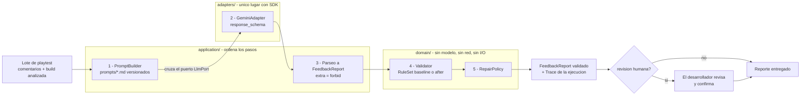
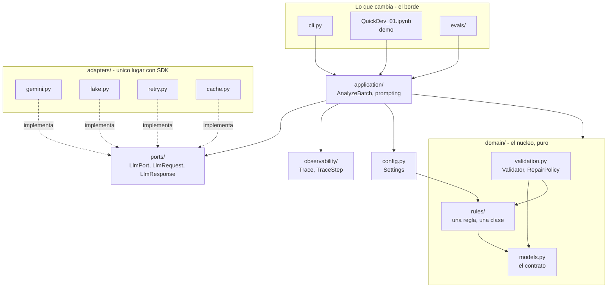
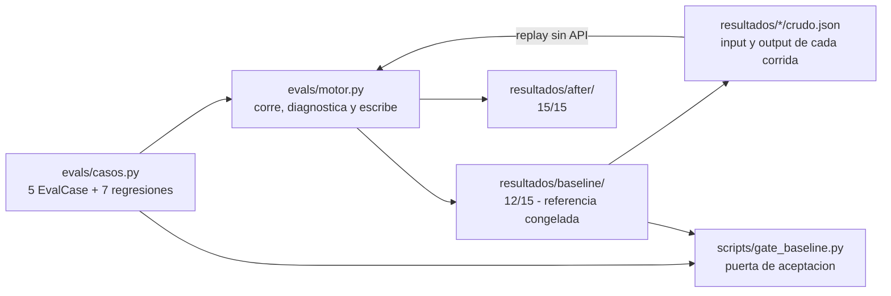

# Arquitectura de QuickDev

Documento de arquitectura del proyecto. Describe **lo que está en `main`**, no un
plan: cada archivo que se menciona existe, y lo que todavía es un stub está
marcado como tal.

Verificado contra `main @ c409cf9` · 14 sep 2026

---

## 1. La tesis, que ordena todo lo demás

> **El modelo interpreta lenguaje. El código verifica hechos.**

El modelo clasifica comentarios por tema, los agrupa, resume y detecta tono.
Código determinista comprueba los conteos contra `len()`, los enums contra listas
cerradas, y que cada cita exista literalmente en el lote.

Esa frase no es un eslogan: es el criterio con el que se decide, ante cada
requisito nuevo, de qué lado de la frontera va. Y es la razón de que la
arquitectura sea hexagonal — un dominio puro rodeado de adaptadores es
exactamente la forma de código que esa frontera pide.

**Una instrucción en el prompt no es una garantía. Una validación posterior sí.**
El prompt pide al modelo que no invente números; el validador lo comprueba. Las
dos cosas hacen falta, y solo la segunda es verificable.

---

## 2. El flujo de una ejecución



Los números marcan una secuencia real: hoy los pasos son fijos y en ese orden.
`LlmPort` aparece como **etiqueta de la flecha, no como nodo**, porque no es un
paso del flujo: es la interfaz que el adaptador implementa y la frontera que la
llamada cruza. La relación "implementa" se ve en el diagrama de capas, abajo.

Tres cosas que este diagrama afirma y que conviene leer despacio:

**El modelo entra una sola vez, y entra por un puerto.** No hay una segunda
llamada para "revisar" lo que dijo la primera. Eso hace el sistema barato y
predecible, y es una decisión consciente: hoy QuickDev **no es un agente**, es una
extracción estructurada con validación posterior. Para este caso de uso eso es lo
correcto — no hay decisiones encadenadas ni herramientas que invocar.

**La validación ocurre después del modelo y sin él.** `Validator` no puede
llamar a Gemini ni siquiera si quisiera: `domain/` no importa nada de
infraestructura, y hay una comprobación que lo verifica (sección 7).

**El rombo no es decorativo.** `requiere_revision_humana` lo puede encender el
modelo, pero el código lo **fuerza** cuando encuentra cualquier hallazgo. Un
reporte que afirma algo falso nunca sale sin pasar por una persona.

---

## 3. Las capas y la dirección de las dependencias

Esta es la regla estructural del proyecto: **las flechas apuntan siempre hacia
adentro**. Nada de `domain/` sabe que existen los adaptadores.



Las flechas continuas son **dependencias** y las punteadas, **implementaciones**.
Que las dos apunten hacia dentro es el principio de inversión de dependencias
dibujado: ni el caso de uso depende del SDK, ni el SDK del caso de uso — los dos
dependen de la misma abstracción, `LlmPort`. Eso es lo que permite componer
`CachingLlm(RetryingLlm(GeminiAdapter()))` en producción y `FakeLlm()` en los
tests, sin que `application/` ni `domain/` se enteren.

El grafo de imports real se puede extraer del código y coincide con este dibujo:

| Módulo | Importa de `quickdev` |
| --- | --- |
| `domain/models.py` | — *nada, es la hoja* |
| `domain/rules/base.py` | `domain.models` |
| `domain/rules/counts.py` | `domain.models`, `domain.rules.base` |
| `domain/rules/citations.py` | `domain.models`, `domain.rules.base` |
| `domain/rules/versioning.py` | `domain.models`, `domain.rules.base` |
| `domain/rules/review.py` | `domain.models`, `domain.rules.base`, `domain.rules.versioning` |
| `domain/rules/registry.py` | `domain.rules.base` y los cuatro módulos de reglas |
| `domain/validation.py` | `domain.models`, `domain.rules.base` |
| `ports/llm.py` | — *nada* |
| `observability/trace.py` | — *nada* |
| `config.py` | `domain.rules.registry` |
| `application/prompting.py` | `domain.models` |
| `application/types.py` | `domain.models`, `domain.rules.base`, `observability.trace` |
| `application/analyze_batch.py` | los ocho anteriores |
| `adapters/` | — *vacío todavía* |

Tres detalles de ese grafo que no son accidentes:

**`ports/llm.py` no depende del dominio.** El puerto devuelve un `dict`, no un
`FeedbackReport`; el parseo al modelo de dominio ocurre en `application/`. Eso
tiene dos consecuencias buenas: los adaptadores se pueden escribir sin esperar a
que el dominio esté listo, y el JSON crudo del modelo se conserva intacto, que es
lo que los evals necesitan para distinguir "falló el prompt" de "faltó
validación".

**`application/analyze_batch.py` es el único módulo que importa ocho cosas.** Es
a propósito: es el único que conoce el orden completo del flujo. Todo lo demás
conoce solo su vecino.

**`config.py` importa del dominio, y en esa dirección está bien.** Depende de
`domain.rules.registry` para validar al arrancar que el `rules_version` pedido
existe, en vez de reventar con un `KeyError` a mitad de una corrida de evals que
ya gastó llamadas a la API. La flecha va hacia adentro, que es la regla.

---

## 4. La frontera: dónde está cada cosa

Makers pidió documentar "la frontera entre notebook, motor de evals, casos,
outputs y reportes". Esta es la traducción de ese vocabulario al repo actual.

| Nombre en el diagrama de Makers | Dónde vive hoy | Estado |
| --- | --- | --- |
| `EntradaProyecto` | `PlaytestBatch` en `quickdev/domain/models.py` | implementado |
| `AgenteQuickDev` | `AnalyzeBatch` (`application/`) + `GeminiAdapter` (`adapters/`) | stub / pendiente |
| `ContratoSalida` | `FeedbackReport`, esquema `v1.1` | implementado |
| `MotorEvals` | `evals/motor.py` hoy → se reparte en `evals/runner.py`, `diagnosis.py`, `reporting.py` | funcionando, se reescribe |
| `CasosEval` | `evals/casos.py` | funcionando |
| `ReporteBaseline` | `evals/resultados/baseline/` | medido y congelado |
| `ReporteAfter` | `evals/resultados/after/` | medido |

### El notebook ya no es el sistema

Este es el cambio más importante respecto de la versión que Makers revisó.
`QuickDev_01.ipynb` contenía el producto: el esquema, el validador, los prompts y
las pruebas. Eso producía un problema medible: `validate_output`, `OUTPUT_SCHEMA`
y `build_input` estaban escritos **dos veces**, en el notebook y en
`evals/motor.py`, y habían divergido. La copia del notebook era la vieja, con un
falso positivo que la otra ya tenía corregido. La respuesta a "¿el validador
atrapa el edge case de versión?" dependía de qué archivo abrieras.

Ahora el paquete `quickdev/` es la única fuente, y el notebook queda como **demo
narrada**: unas pocas celdas que importan `quickdev` y muestran el flujo, sin
lógica propia. Sirve para la sustentación; no es código de producción.

---

## 5. Los evals: dónde están los casos y dónde quedan los resultados



### Qué hay en cada carpeta de resultados

`baseline/` y `after/` contienen la misma estructura de cuatro archivos:
`resultados.csv` (una fila por corrida), `diagnostico.md` (las 7 preguntas
respondidas por eval), `crudo.json` (input y output de cada corrida) y
`regresion.csv`.

Son dos mediciones reales, no ejemplos:

| | baseline | after |
| --- | --- | --- |
| Happy path | 3/3 | 3/3 |
| Input incompleto | 3/3 | 3/3 |
| Input ambiguo | 3/3 | 3/3 |
| Input adversarial | 3/3 | 3/3 |
| Edge case de versión | **0/3** | **3/3** |
| **Total** | **12/15** | **15/15** |
| Regresiones deterministas | 5 PASS / 2 FAIL | 7 PASS |

El salto de `0/3` a `3/3` en el edge case es la mejora medida del proyecto. El
caso: la build analizada es `v0.8.2` pero un jugador cita la `v0.5` dentro de su
comentario. Las dos versiones aparecen literalmente en el input, así que la regla
del prompt ("la versión debe aparecer literalmente") no desempata. Se arregló con
dos cambios a la vez —una regla nueva en el validador y una instrucción más
precisa en el prompt—, y eso hay que decirlo: no fue solo prompt.

### `crudo.json` es la pieza que hace los evals reproducibles

Guarda el input y el output de cada corrida — 15 por medición. Eso permite
**re-evaluar sin llamar a la API**, y es lo que va a alimentar el `FakeLlm`: un
adaptador que reproduce esos outputs convierte el pipeline completo en un test de
CI, sin red y sin cuota.

Comprobado: `python -m evals.motor --modo after --desde-crudo` regenera los cuatro
archivos de `resultados/after/` **byte a byte idénticos** a los que están
commiteados, sin tocar la red. Cualquiera puede clonar el repo y reproducir la
medición de 15/15 sin una API key.

Una advertencia sobre ese comando: escribe encima de `resultados/<modo>/` en vez
de crear un directorio nuevo. Hoy no pierde nada porque la salida coincide, pero
una corrida con reglas distintas **borraría la medición anterior**. Está
identificado y asignado; la solución es un directorio por corrida, estampado con
las versiones y el `git_sha`.

### La puerta de aceptación

`scripts/gate_baseline.py` compara las regresiones deterministas contra
`baseline/regresion.csv` y sale con código 1 si algo difiere. Es lo que prueba
que un refactor no cambió el comportamiento medido. Hoy da **7/7**: 5 PASS y los
2 FAIL deliberados, que existen para exponer el falso positivo del validador
baseline.

Vive en `scripts/` y no en `evals/` porque las tres ramas de trabajo la necesitan,
incluida la que se mergea antes de que exista el harness nuevo.

---

## 6. Estado real: qué está construido y qué falta

| Archivo | Estado |
| --- | --- |
| `domain/models.py` | **implementado** · 8 campos requeridos, `extra="forbid"`, `SCHEMA_VERSION="v1.1"` |
| `domain/rules/base.py` | **implementado** · `Rule`, `Finding`, `Severity`, `RuleSet` |
| `domain/rules/counts.py` | **implementado** · `TotalMatchesBatch`, `FrequencyWithinTotal` |
| `domain/rules/citations.py` | **implementado** · `QuotesAreLiteral` |
| `domain/rules/versioning.py` | **implementado** · 3 reglas, el edge case del producto |
| `domain/rules/review.py` | **implementado** · 3 reglas de revisión humana |
| `domain/rules/registry.py` | **implementado** · `rule_set("baseline"\|"after")` |
| `domain/validation.py` | **implementado** · `Validator` y `RepairPolicy`, separados |
| `application/analyze_batch.py` | **implementado** · 5 pasos explícitos, con `Trace` |
| `application/types.py` | **implementado** · `AnalysisResult` |
| `ports/llm.py` | **implementado** · `LlmPort`, `LlmRequest/Response`, retryable vs terminal |
| `observability/trace.py` | **implementado** · `Trace`, `TraceStep` |
| `config.py` | **implementado** · `Settings`, valida el conjunto de reglas al arrancar |
| `application/prompting.py` | Protocol declarado · `PromptRegistry` pendiente |
| `adapters/` | vacío · `gemini`, `fake`, `retry`, `cache` pendientes |
| `cli.py` | no existe |

Son **9 reglas**, no las 12 que el plan preveía: siete comprobaciones del
validador original se fueron al sistema de tipos y las reglas que las
reimplementaran serían código muerto. La tabla de qué se fue y a dónde está en el
ADR-0003.

Lo que falta son los adaptadores y los prompts. Mientras no existan, el pipeline
completo ya se prueba con dobles del puerto:
`tests/application/test_analyze_batch.py` corre `AnalyzeBatch` de punta a punta
sin red, sin clave y sin cuota. Eso es exactamente para lo que sirve tener un
puerto.

---

## 7. Cómo correrlo desde cero

Criterio de aceptación de Makers: *"alguien debe poder clonar, leer el README,
correr evals y entender qué mejoró sin preguntarles"*. Estos son los comandos
exactos, verificados en Windows con Python 3.14.

```bash
git clone https://github.com/david181222/QuickDev.git
cd QuickDev
python -m venv .venv
./.venv/Scripts/python.exe -m pip install -e ".[dev]"
```

Sin API key ya se puede correr todo esto:

```bash
./.venv/Scripts/python.exe -m pytest                            # 19 passed
./.venv/Scripts/python.exe -m ruff check .                      # All checks passed!
./.venv/Scripts/python.exe scripts/gate_baseline.py             # 7/7 Puerta ABIERTA
./.venv/Scripts/python.exe -m evals.motor --modo baseline --solo-regresiones
```

Para re-evaluar una medición guardada, tampoco hace falta API:

```bash
./.venv/Scripts/python.exe -m evals.motor --modo after --desde-crudo
```

Solo hace falta la clave para corridas nuevas contra el modelo:

```bash
cp .env.example .env        # y pega la GEMINI_API_KEY
./.venv/Scripts/python.exe -m evals.motor --modo after --n 3
```

### Comprobar que el dominio sigue puro

La regla estructural del proyecto es verificable, no un acuerdo verbal:

```bash
grep -rnE "^\s*(import|from)\s+(google|pandas|requests|os|pathlib)" \
     --include="*.py" quickdev/domain/
```

Debe salir vacío. Ojo: un `grep` de `"genai|pandas"` a secas da falsos positivos,
porque los docstrings del paquete mencionan esas palabras al explicar justamente
esta regla.

---

## 8. Las decisiones y dónde está escrito el por qué

Cada decisión de arquitectura tiene su ADR en `docs/adr/`, con contexto,
decisión, consecuencias y alternativas descartadas.

| ADR | Qué decide |
| --- | --- |
| [0001](adr/0001-arquitectura-hexagonal.md) | Puertos y adaptadores: por qué, y qué patrones **no** usamos |
| [0002](adr/0002-convenciones-de-codigo-y-contrato.md) | Inglés en el código, español en el contrato; evolución aditiva del esquema |
| [0003](adr/0003-una-regla-una-clase.md) | Una regla, una clase; una versión, una composición. Y el bug de las citas |
| [0004](adr/0004-detectar-vs-reparar.md) | `Validator` y `RepairPolicy` separados, y la única divergencia con el validador viejo |
| [0005](adr/0005-evidencia-por-indice.md) | El modelo señala, el código cita y cuenta. Decidido, pendiente de medición |

Pendientes, con dueño asignado: el puerto y los adaptadores decorados, resultados
versionados con manifiesto, las correcciones al diagnóstico, el structured output
del proveedor, y el notebook como demo delgada.

### La fidelidad del refactor está medida, no afirmada

`tests/domain/test_equivalencia_baseline.py` compara la implementación nueva
contra `evals/motor.py:validate_output` sobre los 37 casos que existen en el repo
—las 7 regresiones y las 30 corridas guardadas— por las dos versiones del
conjunto de reglas. Compara la lista de mensajes, contenido y orden, y el reporte
ya reparado.

Resultado: **72 de 74** listas de mensajes idénticas, **14 de 14** veredictos
PASS/FAIL preservados, y **una** divergencia admitida y documentada en el
ADR-0004 (el validador viejo se tragaba un hallazgo porque corregía en medio de
la detección).

### Lo que deliberadamente no hacemos

Anotado para poder justificar su ausencia: sin contenedor de inyección de
dependencias, sin event bus, sin repositorios ni ORM, sin abstract factory sobre
proveedores que no tenemos. Son tres personas y un caso de uso. Un patrón que no
resuelve un problema que ya sentimos es solo código que hay que mantener.

---

## 9. Límites conocidos

Se listan aquí porque un documento que declara sus límites es más útil —y más
defendible— que uno que promete que todo funciona.

- **Escala no probada.** El contrato habla de "cientos de comentarios por ciclo";
  el eval más grande tiene 14. A 300 comentarios en una sola llamada, el campo
  `problemas_detectados` se degradará y `max_output_tokens` empezará a truncar.
  Falta un eval de lote grande y una estrategia de map-reduce con fusión
  determinista.
- **n = 3 es una muestra pequeña.** Con tres corridas no se distingue un fallo
  intermitente de un defecto, y la pregunta más costosa del diagnóstico
  ("¿elegimos mal el modelo?") se estaba respondiendo sobre esa base. El default
  ya está subido a 10 en `Settings`; falta correrlo.
- **Dos de las siete preguntas de diagnóstico no son independientes.** "¿Faltó
  contexto?" se deriva de un subconjunto de lo que responde "¿Falló el prompt?",
  así que nunca puede dar SÍ si la otra dio NO.
- **`contract_frozen.json` contradice al código** en dos puntos: las fuentes
  permitidas que declara no coinciden con el enum que se valida, y lista en
  `ai_job` "extraer la versión mencionada en los comentarios", que es justo el
  trabajo que el arreglo del edge case le quitó al modelo.
- **No se mide el coste.** Se registra la latencia, pero no los tokens ni el
  dinero. Sin coste, "¿elegimos mal el modelo?" no se puede responder bien: un
  modelo mejor que cuesta diez veces más puede ser la respuesta incorrecta.
- **Esto no es un agente, y hoy no debe serlo.** Es una llamada única con esquema
  fijo y validación posterior. El `Trace` de `observability/` es la costura
  preparada para que, cuando los pasos los decida un bucle en vez de una lista,
  el dominio no cambie.
